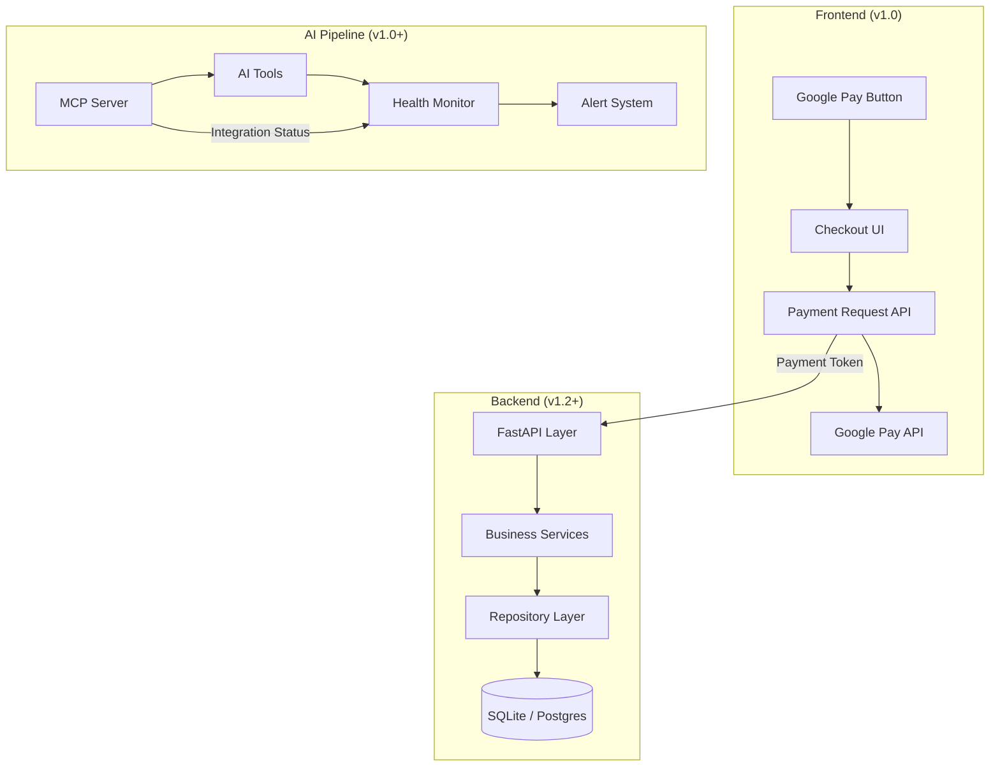
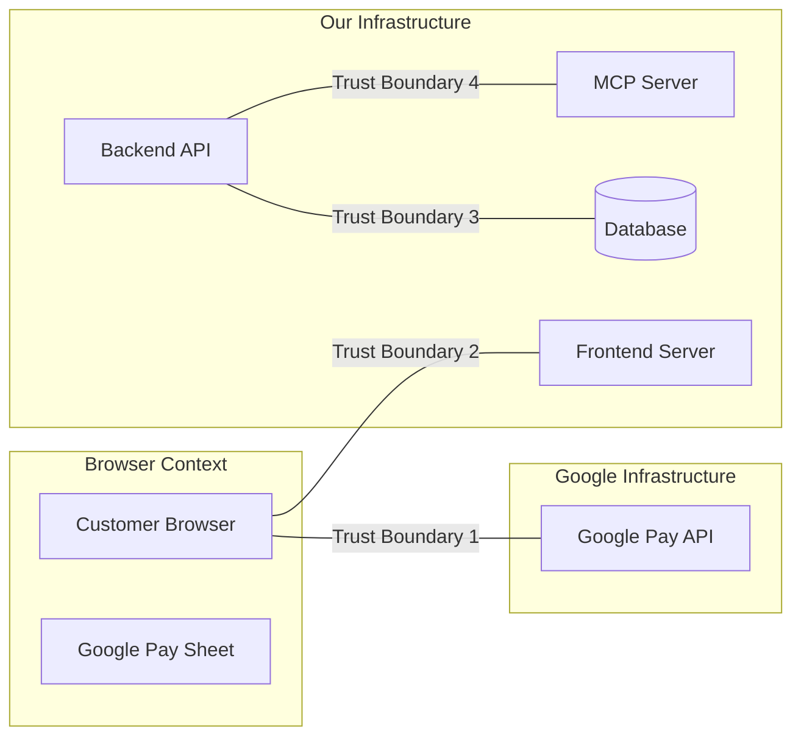

# Design Document: Google Pay AI Checkout Platform

## Overview

This document describes the architecture of the Google Pay AI Checkout Platform — an AI-native payment processing application that integrates Google Pay for web-based checkout flows. The platform handles standard checkout, merchant-initiated transactions (MIT) for recurring billing, dynamic pricing based on card funding source, and an AI-powered monitoring pipeline built on MCP (Model Context Protocol) integration.

The system is designed for incremental delivery across versioned milestones:

### v1.0 — Internship Deliverable (Implementation Scope)

This is the only version implemented during the repository bootstrap and initial development. All v1.0 components are driven by the Google Pay API Codelab:

- **Checkout Frontend**: HTML/CSS/JS application with Google Pay button integration
- **Google Pay Integration**: Payment request API, `isReadyToPay`, payment sheet flow
- **MCP Integration**: Model Context Protocol server setup for AI-grounded development
- **Antigravity Workflow**: Spec-driven development using Antigravity AI tool
- **Dynamic Pricing**: Card funding source-based routing and pricing via `cardFundingSource`
- **Merchant-Initiated Transactions (MIT)**: Recurring/subscription payment handling
- **Express Guest Checkout**: Streamlined checkout without account creation
- **AI Monitoring Pipeline**: LLM-driven integration health monitoring via MCP
- **Environment**: TEST environment only (no production deployment)

### Future Roadmap (Architecture Only — NOT Implemented in v1.0)

The following versions are documented for architectural planning purposes. They guide directory structure and interface design but MUST NOT be implemented during bootstrap or v1.0:

- **v1.2**: Backend API layer (FastAPI), business logic services, repository layer (SQLite), Docker deployment
- **v2**: Production deployment, Postgres migration, containerized infrastructure
- **v3+**: Customer accounts, saved payment methods, authentication

The bootstrap process (defined in requirements.md) establishes the repository skeleton, documentation, and governance. This design focuses on the complete target architecture, with clear delineation of what is built now (v1.0) versus what is planned for later.

## Architecture

### Layered Architecture

The platform follows a layered architecture pattern (API → Business → Repository) with clear separation of concerns:



### Trust Boundaries



### Key Architecture Decisions

| Pattern | Applied To | Rationale |
|---------|-----------|-----------|
| Layered Architecture | API → Business → Repository | Testability, clear contracts between layers |
| Strategy Pattern | Pricing calculation | Multiple pricing rules (credit vs debit routing) |
| Adapter Pattern | MCP client wrapping | Isolate AI tool integration from business logic |
| Facade Pattern | CheckoutService | Single entry point for complex checkout orchestration |
| Factory Pattern | Payment request objects | Varying payment configurations per merchant/environment |
| Dependency Injection | All service layers | Testability, mock substitution |
| Configuration Pattern | Environment-specific settings | TEST → Staging → Production promotion |

## Components and Interfaces

### 1. Checkout Frontend (v1.0)

**Responsibility**: Render the Google Pay button, manage payment sheet interactions, collect payment tokens.

**Technology**: HTML5, CSS3, Vanilla JavaScript

**Interfaces**:
- `initGooglePay(config: MerchantConfig): void` — Initialize the Google Pay client
- `onPaymentAuthorized(paymentData: PaymentData): Promise<PaymentResult>` — Handle authorized payment callback
- `createPaymentRequest(cart: CartItems): PaymentDataRequest` — Build a Google Pay payment request object

**Dependencies**: Google Pay API (`pay.js` library)

**Key Behaviors**:
- Displays Google Pay button only when `isReadyToPay()` resolves true
- Constructs `PaymentDataRequest` with merchant info, allowed payment methods, transaction info
- Receives encrypted payment token from Google Pay sheet
- Forwards token to backend for processing (v1.2) or logs for testing (v1.0)

### 2. MIT (Merchant-Initiated Transaction) Module (v1.0)

**Responsibility**: Handle recurring and subscription payment flows where the merchant charges without direct customer interaction.

**Interfaces**:
- `createMITAgreement(customerId: string, terms: MITTerms): MITAgreement` — Establish a recurring billing agreement
- `executeMITCharge(agreementId: string, amount: Money): ChargeResult` — Execute a merchant-initiated charge
- `cancelMITAgreement(agreementId: string): CancelResult` — Cancel a recurring agreement

**Key Behaviors**:
- Stores customer consent and billing agreement tokens
- Executes charges with idempotency keys to prevent duplicate billing
- Tracks charge history per agreement
- Validates agreement is active before executing charges

### 3. Dynamic Pricing Module (v1.0)

**Responsibility**: Route transactions and calculate pricing based on `cardFundingSource` (CREDIT, DEBIT, PREPAID).

**Interfaces**:
- `calculatePrice(baseAmount: Money, fundingSource: CardFundingSource): PricedTransaction` — Apply pricing rules
- `getRoutingStrategy(fundingSource: CardFundingSource): RoutingConfig` — Determine processing route
- `registerPricingRule(rule: PricingRule): void` — Add a pricing strategy

**Key Behaviors**:
- Implements Strategy Pattern for pricing calculation
- Debit cards may receive different interchange optimization
- Prepaid cards may have additional validation rules
- Pricing rules are configurable per merchant and environment

### 4. AI Monitoring Pipeline (v1.0)

**Responsibility**: LLM-driven integration health monitoring via MCP. Monitors Google Pay API availability, detects anomalies, generates alerts.

**Interfaces**:
- `checkIntegrationHealth(): HealthReport` — Run health diagnostics via MCP
- `analyzeTransactionAnomaly(metrics: TransactionMetrics): AnomalyReport` — LLM-powered anomaly detection
- `generateIncidentSummary(incident: Incident): string` — AI-generated incident summaries

**Key Behaviors**:
- Wraps MCP server communication via Adapter Pattern
- Periodically polls integration endpoints
- Uses LLM to interpret error patterns and suggest remediation
- All AI-generated recommendations require human review before action

### 5. Backend API Layer (v1.2 — Future Roadmap)

**Responsibility**: HTTP API for payment processing, request validation, OpenAPI documentation.

**Scope Note**: This component is NOT implemented in v1.0. It is documented here for architectural planning only.

**Technology**: FastAPI (Python, async-native)

**Interfaces**:
```python
@app.post("/api/v1/checkout")
async def process_checkout(request: CheckoutRequest) -> CheckoutResponse

@app.post("/api/v1/mit/charge")
async def process_mit_charge(request: MITChargeRequest) -> ChargeResponse

@app.get("/api/v1/health")
async def health_check() -> HealthResponse

@app.get("/api/v1/pricing/calculate")
async def calculate_pricing(request: PricingRequest) -> PricingResponse
```

**Key Behaviors**:
- Server-side validation of all payment amounts (prevents client-side tampering)
- Idempotency key enforcement on all mutation endpoints
- OpenAPI schema auto-generation
- Structured error responses with correlation IDs

### 6. Business Services Layer (v1.2 — Future Roadmap)

**Responsibility**: Checkout orchestration, pricing strategy execution, MIT scheduling.

**Scope Note**: This component is NOT implemented in v1.0. It is documented here for architectural planning only.

**Components**:
- `CheckoutService` (Facade): Orchestrates the full checkout flow
- `PricingService`: Executes pricing strategies based on card funding source
- `MITScheduler`: Manages recurring charge scheduling
- `TokenHandler`: Transient token processing (never persisted)

### 7. Repository Layer (v1.2 — Future Roadmap)

**Responsibility**: Data persistence, query abstraction.

**Scope Note**: This component is NOT implemented in v1.0. It is documented here for architectural planning only.

**Technology**: SQLite (v1.2) → PostgreSQL (v2+)

**Components**:
- `TransactionRepository`: CRUD for transaction records
- `AgreementRepository`: MIT agreement storage
- `AuditRepository`: Audit log persistence

### 8. Authentication Module (v3 — Future Roadmap)

**Responsibility**: Customer accounts, saved payment methods, session management.

**Scope Note**: This component is NOT implemented in v1.0. It is documented here for architectural planning only. Deferred to v3. Interface stubs may exist earlier for planning.

## Data Models

### Core Domain Objects

```typescript
interface PaymentToken {
  // Encrypted token from Google Pay - NEVER persisted
  tokenData: string;
  expiresAt: ISO8601Timestamp;
  paymentMethod: AllowedPaymentMethod;
}

interface Money {
  amount: number;        // Integer cents (avoids floating-point)
  currency: CurrencyCode; // ISO 4217 (e.g., "USD")
}

interface CheckoutRequest {
  merchantId: string;
  cartItems: CartItem[];
  totalAmount: Money;
  paymentToken: PaymentToken;
  idempotencyKey: string; // Client-generated UUID
}

interface CartItem {
  id: string;
  name: string;
  quantity: number;  // Positive integer
  unitPrice: Money;
}

interface CheckoutResponse {
  transactionId: string;
  status: "APPROVED" | "DECLINED" | "PENDING";
  approvedAmount: Money;
  timestamp: ISO8601Timestamp;
}

type CardFundingSource = "CREDIT" | "DEBIT" | "PREPAID";

interface PricingRule {
  fundingSource: CardFundingSource;
  discountBps: number;      // Basis points discount
  surchargeAllowed: boolean;
  routingPreference: string;
}

interface MITAgreement {
  agreementId: string;
  customerId: string;
  status: "ACTIVE" | "CANCELLED" | "EXPIRED";
  terms: MITTerms;
  createdAt: ISO8601Timestamp;
  lastChargeAt: ISO8601Timestamp | null;
}

interface MITTerms {
  frequency: "DAILY" | "WEEKLY" | "MONTHLY" | "ANNUAL";
  amount: Money;
  startDate: ISO8601Date;
  endDate: ISO8601Date | null; // null = indefinite
}

interface MITChargeRequest {
  agreementId: string;
  amount: Money;
  idempotencyKey: string;
  chargeReason: string;
}

interface TransactionRecord {
  transactionId: string;
  merchantId: string;
  amount: Money;
  fundingSource: CardFundingSource;
  pricingApplied: PricingRule;
  status: "APPROVED" | "DECLINED" | "REFUNDED";
  createdAt: ISO8601Timestamp;
  idempotencyKey: string;
}

interface HealthReport {
  timestamp: ISO8601Timestamp;
  googlePayApiStatus: "HEALTHY" | "DEGRADED" | "DOWN";
  latencyMs: number;
  lastSuccessfulTransaction: ISO8601Timestamp | null;
  anomalies: AnomalyReport[];
}
```

### Persistence Schema (v1.2+ — Future Roadmap)

> **Note**: This schema is NOT implemented in v1.0. It documents the target persistence design for v1.2+.

```sql
CREATE TABLE transactions (
    transaction_id TEXT PRIMARY KEY,
    merchant_id TEXT NOT NULL,
    amount_cents INTEGER NOT NULL,
    currency TEXT NOT NULL DEFAULT 'USD',
    funding_source TEXT NOT NULL,
    pricing_discount_bps INTEGER NOT NULL DEFAULT 0,
    status TEXT NOT NULL,
    idempotency_key TEXT UNIQUE NOT NULL,
    created_at TEXT NOT NULL
);

CREATE TABLE mit_agreements (
    agreement_id TEXT PRIMARY KEY,
    customer_id TEXT NOT NULL,
    status TEXT NOT NULL DEFAULT 'ACTIVE',
    frequency TEXT NOT NULL,
    amount_cents INTEGER NOT NULL,
    currency TEXT NOT NULL DEFAULT 'USD',
    start_date TEXT NOT NULL,
    end_date TEXT,
    created_at TEXT NOT NULL,
    last_charge_at TEXT
);

CREATE TABLE mit_charges (
    charge_id TEXT PRIMARY KEY,
    agreement_id TEXT NOT NULL REFERENCES mit_agreements(agreement_id),
    amount_cents INTEGER NOT NULL,
    currency TEXT NOT NULL DEFAULT 'USD',
    idempotency_key TEXT UNIQUE NOT NULL,
    status TEXT NOT NULL,
    created_at TEXT NOT NULL
);

CREATE TABLE audit_log (
    id INTEGER PRIMARY KEY AUTOINCREMENT,
    event_type TEXT NOT NULL,
    entity_type TEXT NOT NULL,
    entity_id TEXT NOT NULL,
    payload TEXT, -- JSON
    created_at TEXT NOT NULL
);
```


## Correctness Properties

*A property is a characteristic or behavior that should hold true across all valid executions of a system — essentially, a formal statement about what the system should do. Properties serve as the bridge between human-readable specifications and machine-verifiable correctness guarantees.*

### Property 1: Cart total integrity

*For any* array of cart items with positive quantities and non-negative unit prices, the server-side validation SHALL accept the checkout request if and only if `totalAmount` equals the sum of `(quantity × unitPrice)` for all items.

**Validates: Requirements 2.1**

### Property 2: Mutation idempotency

*For any* checkout or MIT charge request submitted multiple times with the same idempotency key, the system SHALL create exactly one transaction record and return identical responses for all submissions.

**Validates: Requirements 2.1**

### Property 3: Dynamic pricing correctness

*For any* base amount and card funding source with a registered pricing rule, the system SHALL select the rule matching that funding source and compute the final price as `baseAmount - (baseAmount × discountBps / 10000)`, rounded to the nearest cent.

**Validates: Requirements 2.1**

### Property 4: MIT agreement lifecycle enforcement

*For any* MIT agreement that has been cancelled, all subsequent charge attempts against that agreement SHALL be rejected with an appropriate error, regardless of the charge amount or idempotency key.

**Validates: Requirements 2.1**

### Property 5: Invalid cart item rejection

*For any* checkout request containing at least one cart item with a non-positive quantity (≤ 0) or a negative unit price (< 0), the system SHALL reject the entire request without creating a transaction.

**Validates: Requirements 2.1**

### Property 6: Transaction persistence round-trip

*For any* successfully processed checkout, storing the transaction and retrieving it by ID SHALL yield a record where amount (in integer cents), currency, funding source, merchant ID, status, and idempotency key are all exactly equal to the original request values.

**Validates: Requirements 2.1**

### Property 7: MIT charge frequency enforcement

*For any* MIT agreement with a defined billing frequency, a charge attempt made before the minimum interval has elapsed since the last successful charge SHALL be rejected.

**Validates: Requirements 2.1**

## Error Handling

### Error Categories

| Category | HTTP Status | Example | Recovery |
|----------|------------|---------|----------|
| Validation Error | 400 | Invalid cart total, missing fields | Client corrects request |
| Authentication Error | 401 | Invalid/expired token (v3+) | Re-authenticate |
| Idempotency Conflict | 409 | Different payload for same key | Client uses new key |
| Business Rule Violation | 422 | Cancelled agreement charge, frequency violation | Client reviews logic |
| Payment Declined | 402 | Insufficient funds, fraud block | Customer uses different method |
| Internal Error | 500 | Database failure, unexpected state | Retry with backoff |
| Service Unavailable | 503 | Google Pay API down | Retry with backoff, circuit breaker |

### Error Response Format

```json
{
  "error": {
    "code": "VALIDATION_ERROR",
    "message": "Cart total does not match sum of items",
    "correlationId": "uuid-v4",
    "details": [
      {
        "field": "totalAmount",
        "expected": 2500,
        "received": 2400
      }
    ]
  }
}
```

### Resilience Patterns

1. **Circuit Breaker** (Google Pay API calls): After 3 consecutive failures within 30 seconds, open circuit for 60 seconds. Half-open allows single probe request.

2. **Retry with Exponential Backoff** (transient failures): Base delay 100ms, multiplier 2x, max 3 retries, max delay 2s. Jitter applied to prevent thundering herd.

3. **Idempotency Key Handling**:
   - Same key + same payload → return cached response
   - Same key + different payload → return 409 Conflict
   - Idempotency records expire after 24 hours

4. **Graceful Degradation**:
   - If AI monitoring pipeline is unavailable, checkout continues unaffected
   - If pricing service is unavailable, fall back to base price (no discount)
   - If audit logging fails, transaction proceeds but alerts operations team

### Token Security Error Handling

- Payment tokens that fail decryption → reject with generic "payment method invalid" (no details leaked)
- Expired tokens → reject with "token expired, please retry payment"
- Token data NEVER included in error responses or logs

## Testing Strategy

### Dual Testing Approach

The platform uses both property-based tests and example-based tests for comprehensive coverage:

**Property-Based Tests** (universal correctness):
- Library: **Hypothesis** (Python, for backend) + **fast-check** (TypeScript/JavaScript, for frontend logic)
- Minimum 100 iterations per property
- Each test tagged with: `Feature: project-bootstrap, Property {N}: {description}`
- Focus: Payment calculations, idempotency, pricing rules, validation logic

**Example-Based Unit Tests**:
- Focus: Specific scenarios, edge cases, integration points
- Payment token handling (mock Google Pay responses)
- Express guest checkout flow
- Health report structure validation

### Test Organization

```
tests/
├── unit/
│   ├── pricing/          # Dynamic pricing calculations
│   ├── validation/       # Cart validation, input checks
│   ├── mit/              # MIT agreement logic
│   └── checkout/         # Checkout orchestration
├── property/
│   ├── test_cart_integrity.py       # Property 1
│   ├── test_idempotency.py          # Property 2
│   ├── test_pricing.py              # Property 3
│   ├── test_mit_lifecycle.py        # Property 4
│   ├── test_validation.py           # Property 5
│   ├── test_persistence.py          # Property 6
│   └── test_mit_frequency.py        # Property 7
├── integration/
│   ├── test_google_pay_api.py       # Google Pay API integration
│   ├── test_mcp_pipeline.py         # MCP monitoring pipeline
│   └── test_database.py             # Storage layer
└── e2e/
    ├── test_checkout_flow.py        # Full checkout flow
    └── test_mit_flow.py             # Full MIT flow
```

### Property Test Configuration

```python
# Example: Property 1 - Cart total integrity
from hypothesis import given, settings, strategies as st

@settings(max_examples=100)
@given(
    items=st.lists(
        st.fixed_dictionaries({
            "quantity": st.integers(min_value=1, max_value=1000),
            "unitPrice": st.integers(min_value=0, max_value=100000)  # cents
        }),
        min_size=1, max_size=50
    )
)
def test_cart_total_integrity(items):
    """Feature: project-bootstrap, Property 1: Cart total integrity"""
    expected_total = sum(item["quantity"] * item["unitPrice"] for item in items)
    # Verify server validation accepts matching total
    # Verify server validation rejects non-matching total
    ...
```

### Coverage Targets

| Layer | Unit Coverage | Property Coverage |
|-------|--------------|-------------------|
| Pricing Logic | 90% | All 3 funding sources × 100 iterations |
| Validation | 85% | Properties 1, 5 |
| MIT Logic | 85% | Properties 4, 7 |
| Persistence | 80% | Property 6 |
| Idempotency | 80% | Property 2 |
| API Layer | 75% | Via integration tests |
| Frontend | 70% | Via example-based + e2e |

### Integration Testing

- **Google Pay API**: Mock server for unit/property tests; real TEST environment for integration
- **Database**: In-memory SQLite for unit tests; file-based SQLite for integration
- **MCP Server**: Mock MCP responses for unit tests; real MCP for monitoring pipeline integration tests

### CI/CD Test Pipeline

```yaml
# Execution order in CI
1. Lint (ESLint, Ruff)
2. Type check (mypy, tsc)
3. Unit tests (pytest, vitest)
4. Property tests (hypothesis, fast-check) — 100 iterations
5. Integration tests (real dependencies in TEST env)
6. E2E tests (Playwright or equivalent)
7. Coverage report generation
```
